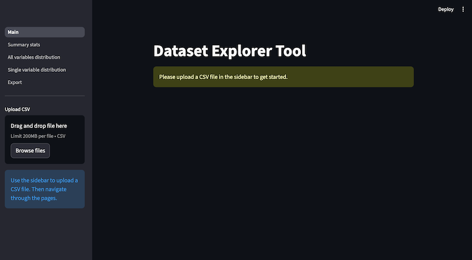

# Dataset explorer tool

Preview dataset, summary statistics, variable distribution



## Run

Unix (Linux/macOS)

```shell
python3 -m streamlit run src/app.py
```

Windows

```shell
streamlit run src/app.py
```

## Decisions

- using Python 3.13.x because pyarrow doesn't support 3.14.0 yet
- streamlit uses file-based routing
